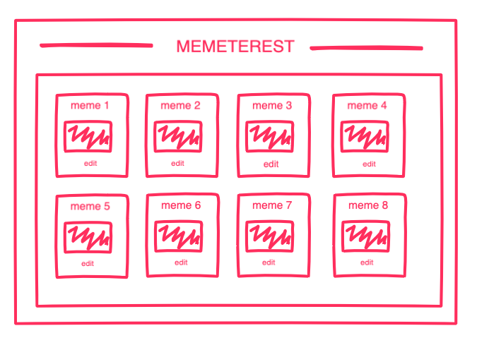
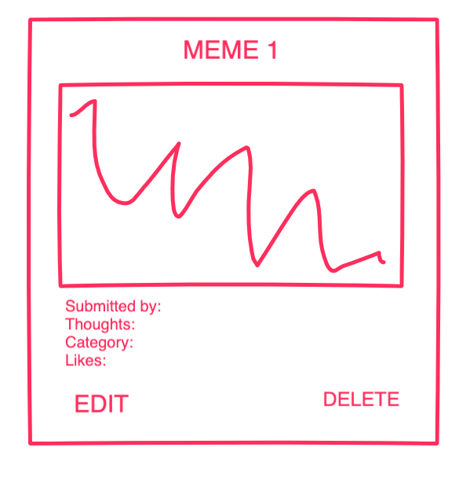

# Memeterest: Meme Boards of Interest
Memeterest is a Pinterest-inspired app that gives users a place to collect their favorite memes, or to create their own! To add a meme, simply input your name, meme url, and meme text and watch it be saved amongst all your other favorite memes.

## Live Link
https://memetrest.herokuapp.com/

## Getting Started
1. Fork the repo and clone to your local machine.
2. In your terminal, bundle install, then run rails and postgreSQL.
3. In postgresQL, create a database "memtrest_development" and create a table => CREATE TABLE memes (id SERIAL, name VARCHAR, image VARCHAR, text VARCHAR);
3. Open localhost:3000.

## Built With
- React
- Ruby on Rails
- JavaScript
- CSS
- HTML

## Contributors
- Alex Hawkins
- Yulli

## User Stories
- User is able to view all memes on hompage
- User can edit the name, description, or image of a meme added to the database
- User can delete memes
- User can add a meme

## Features that will meet MVP
- Rails backend: Create a rails backend with all CRUD operations available across your models.
  - Create: add new meme
  - Read: view all memes on homepage
  - Update: edit memes
  - Delete: delete memes from boards or meme boards entirely
- Must have at least one model
  - Meme Model = {
      name: '',
      image: '',
      text: '' // the username of whoever added it?
  }

- React frontend: Create a React frontend that consumes your Rails backend.
  - See wireframes below.
- Deploy online: Your app must be deployed online to Heroku
 - See live link above
- Must be hosted on Github with frequent commits dating back to the very beginning of the project. Commit early, commit often!
  - https://github.com/secdevyc/memetrest

## Wireframes

## Unsolved Problems / Notes To Self
We would have liked to create board cards on homepage, from which you can view memes that pertain to respective categories.
